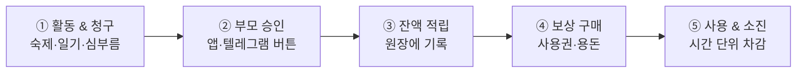
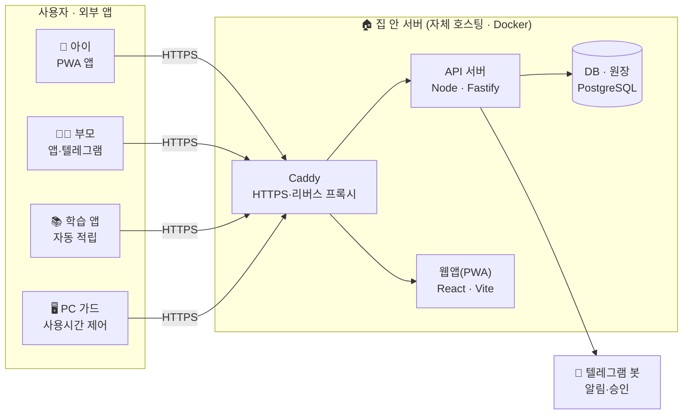

# HomeMileageService (HMS)

가정용 마일리지(포인트) 보상 관리 서비스. 부모가 자녀에게 활동에 대한 마일리지를 부여하고, 자녀는 이를 휴대폰·PC·게임기 사용시간권이나 용돈 등으로 사용한다. 자체 호스팅(홈 서버)으로 운영하며, 우리 가족으로 시작하되 다른 가족에게도 계정을 열어줄 수 있도록 설계한다.

> **상태: v1.4.0 운영 중** — 마일리지 코어(Phase 1)에 이어 외부 학습 앱 자동 적립 연동(Phase 2 코어)까지 동작한다.

---

## 🎯 한눈에 보기

**한마디로, 우리 집 전용 포인트 통장입니다.** 아이가 잘한 일에 마일리지(포인트)를 주면, 아이는 그 포인트를 게임 시간이나 용돈처럼 정해진 보상으로 바꿔 씁니다. 카페 스탬프나 항공사 마일리지와 비슷하지만, **규칙과 가격을 부모가 직접 정하는 우리 가족만의 시스템**이라는 점이 다릅니다. 외부 서비스에 아이 정보를 맡기지 않도록 **집 안 서버에서 직접 운영**합니다.

| | |
|---|---|
| 🪙 **적립** | 숙제·일기·심부름 등 활동을 하면 포인트를 청구하고, 부모가 승인합니다. |
| 🎮 **사용** | 모은 포인트를 휴대폰·PC·게임기 사용시간권이나 용돈으로 바꿉니다. |
| 🛡️ **관리** | 부모가 항목·가격·잔액을 관리하고, 텔레그램·앱 알림으로 실시간 확인합니다. |

## 🔄 이렇게 동작해요

적립을 청구하고 부모가 승인하면 잔액이 쌓이고, 그 잔액으로 보상을 사서 사용합니다.



## ✨ 주요 기능

| 기능 | 설명 |
|---|---|
| 🪙 마일리지 적립·승인 | 활동별 적립 항목을 만들고 청구 → 승인/거절로 관리. 모든 거래는 원장에 기록되어 잔액이 정확합니다. |
| 🎟️ 재고형 사용권 | 사용권을 산 시점과 실제 쓴 시점을 분리. 미사용·부분사용·몰아쓰기를 시간 단위로 추적합니다. |
| 💰 용돈 교환 | 포인트를 현금 용돈으로 교환 신청하면 부모가 지급 완료 처리해 정산합니다. |
| 🔔 실시간 알림 | 부모는 텔레그램 인라인 버튼으로 즉시 승인/거절, 아이는 앱 웹푸시로 결과를 받습니다. |
| 🔌 외부 앱 연동 | 학습 앱 등이 적립 API로 자동 청구(중복 차단 내장). 예: 영어 학습 100점 달성 시 자동 적립. |
| 🖥️ PC 사용시간 가드 | 아이 PC 세션을 잔여 시간만큼만 허용하고, 소진되면 화면을 잠급니다. 실제 사용한 시간만 차감합니다. |
| 📱 설치형 웹앱(PWA) | 앱스토어 없이 홈 화면에 설치해 앱처럼 사용. 자녀·부모 화면이 나뉘어 있습니다. |
| 👨‍👩‍👧 가족별 데이터 격리 | 가족(테넌트) 단위로 데이터가 분리됩니다. 다른 가족에게도 계정을 열어줄 수 있습니다. |
| 🔒 자체 계정·호스팅 | 이메일·소셜 없이 전용 계정으로 운영. 집 서버에서 돌아가고 통신은 HTTPS로 보호됩니다. |

## 🏗️ 서비스 구성도

아이·부모의 기기에서 집 안 서버로 연결되고, 학습 앱이나 PC 가드 같은 외부 앱도 같은 서버에 붙습니다. 외부에는 웹 포트만 공개되고 데이터베이스는 서버 안에서만 접근합니다.



> 공유기의 동적 IP가 바뀌어도 주소가 자동으로 따라오도록 구성되어 있고, 인증서는 자동 갱신되어 항상 **HTTPS 보안 연결**로 접속합니다. 모든 시크릿은 서버에만 보관됩니다.

## 👥 누가 무엇을 하나요

| 역할 | 하는 일 |
|---|---|
| 🧒 **아이** | 아이디+PIN 로그인 · 적립 청구(증빙 사진) · 사용권 구매/사용 · 용돈 교환 신청 |
| 🧑‍🍼 **부모** | 청구 승인/거절 · 카탈로그·가격 관리 · 용돈 지급 정산 · 실시간 알림 수신 |
| ⚙️ **관리자** | 가족(테넌트) 생성·관리 · 계정 관리 · 백업 등 운영 · 다른 가족 온보딩 |

---

## 개요

- **적립**: 학교 숙제, 한 줄 일기, 심부름 등 자녀 활동에 마일리지 부여. 영어 학습 앱 연동 시 100점 달성 자동 적립.
- **사용**: 휴대폰/PC/게임기 사용시간권, 용돈 교환 등.
- **운영 모델**: 부모가 자녀 계정을 생성·관리하고, 적립 청구를 승인한다(웹 또는 텔레그램 인라인 버튼).

## 핵심 설계 결정

| 항목 | 결정 |
|---|---|
| 계정/인증 | 서비스 전용 자체 계정 (이메일·소셜 비의존). 부모가 자녀 계정 생성·관리, 자녀는 아이디+PIN |
| 적립/사용 | 적립은 부모 승인, 사용은 잔액 내 자동 차감 |
| 사용권 모델 | 재고형 — 구매(포인트 차감)와 실제 사용(소진)을 분리해 미사용·부분사용·몰아쓰기 추적 |
| 가격·환율 | 항목별 고정 가격표(부모가 언제든 수정) |
| 알림 | 부모는 텔레그램 봇(인라인 승인 버튼), 자녀는 앱(PWA) 웹푸시 |
| 멀티테넌시 | 가족(테넌트) 단위 데이터 격리 — 처음부터 반영 |
| 클라이언트 | PWA(설치형 웹앱) 우선 → 필요 시 래퍼 앱으로 보강 |
| 외부 앱 연동 | 학습 앱 등 외부 클라이언트가 적립 청구 API로 자동 청구(중복 차단 내장) |

## 아키텍처

- **프론트엔드**: React + Vite (PWA) — `web/`
- **백엔드**: Node + Fastify — `server/`
- **DB**: PostgreSQL (마일리지는 원장/ledger 기반 — 잔액을 누적 거래로 산출)
- **인증**: 자체 계정 (scrypt 해시 + JWT), 부모/자녀/관리자 역할 분리
- **배포**: Docker + Caddy(리버스 프록시, 자동 HTTPS) — `deploy/`. 웹 포트만 외부 공개, DB는 비공개.
- **호스팅**: 자체 홈 서버(Rocky Linux 9, Docker)

## 구조·실행

```
server/   # Fastify API (src/, migrations/, scripts/, test/)
web/      # React PWA (자녀·부모 화면)
deploy/   # docker-compose.yml, Caddyfile, remote_deploy.sh
```

로컬 개발:

```bash
cd server && npm install && npm test        # 내장 Postgres로 E2E
cd web && npm install && npm run dev        # /api 프록시 → localhost:3000
```

서버 배포: `web`을 `npm run build`로 빌드해 `hms/dist`로 포함한 번들을 만들고 `deploy/remote_deploy.sh`를 서버에서 실행한다. 시크릿(DB 비밀번호·JWT·봇 토큰)은 서버의 `hms.env`(chmod 600)에만 둔다 — `server/.env.example` 참조.

## 도메인 모델 (요약)

마일리지는 **원장(ledger)** 으로 관리한다. 모든 적립·차감을 거래로 누적하고 합산해 잔액을 도출하며, 조회용 잔액 캐시를 둔다.

- 적립 청구(earn request): `대기 → 승인/거절` (부모 승인 시 잔액 반영)
- 사용권 구매(spend order): 잔액 충분 시 자동 차감 + 사용권(voucher) 발급
- 사용권(voucher): `보유 → 부분 사용 → 소진` (시간 단위 잔여 추적)
- 용돈 교환: 포인트 차감 + 현금 지급 정산(부모 지급 완료 처리)

## 외부 앱 연동 (v1.4.0+)

학습 앱 등 외부 클라이언트는 자녀 계정으로 로그인한 뒤 적립 청구 API를 호출한다.

- `POST /api/earn-requests` 에 선택 필드 `source_kind`(출처), `ext_ref`(외부 참조 ID), `meta`(JSON) 지원
- 같은 `(가족, 자녀, ext_ref)` 조합은 1회만 청구 가능 — 중복 시 `409 duplicate_claim` (청구 취소 시 재청구 가능)
- 승인 흐름은 일반 청구와 동일 (부모 웹/텔레그램 승인)

연동 사례: 영어 학습 앱(EnglishSnap) — 퀴즈 정답률 100% 달성 시 자동 청구, 앱 단 일일 청구 한도(부모 인증으로 변경).

## 로드맵

| 단계 | 범위 | 상태 |
|---|---|---|
| Phase 0 | 인프라 셋업 (Docker/Caddy/HTTPS, DB, 백업) | ✅ 완료 |
| Phase 1 (MVP) | 자체 계정·멀티테넌시, 적립 승인, 재고형 사용권, 가격표, 알림, PWA | ✅ 완료 (v1.1.0~v1.3.2) |
| Phase 2 | 영어 학습 앱 연동 (학습 100점 자동 적립, 중복 차단) | ✅ 코어 완료 (v1.4.0) · LLM 프록시 이전은 진행 예정 |
| Phase 3 | 사용권 기기 자동 적용 (노트북 세션 제어 등) | 예정 |
| Phase 4 | 다가족 운영 (관리자 콘솔, 가족 발급) | 일부 (관리자 가족/계정 관리 구현) |

## 다음 단계

- 학습 앱 LLM API 키 서버 프록시 이전(클라이언트 노출 제거)
- 사용권 만료 정책·정산 취소 등 사용 UX 다듬기
- Phase 3: 사용권 소진형 기기 세션 제어 검토

자세한 진행 내역은 Issues와 Releases 참조.
